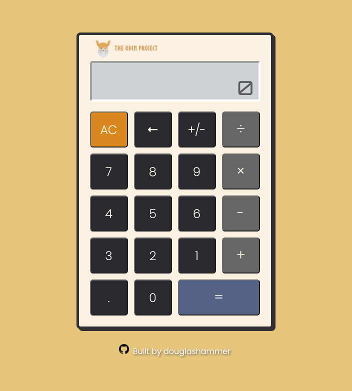

# Calculator
A simple, retro-inspired calculator application.
Assignment from [The Odin Project](https://www.theodinproject.com/paths/foundations/courses/foundations/lessons/calculator)

## Technologies/Tools
* Visual Studio Code
* HTML/CSS/JavaScript
* Google Fonts

## Project Summary
* Improved on CSS design. Vision for design didn't feel held back by lack of knowledge
* Improved on creating specific functions for each event type
* Learned to create Boolean variables that check for specific steps to begin if/else checks
* Lots of Google, took a while to figure out the negative button/backspace functionality

